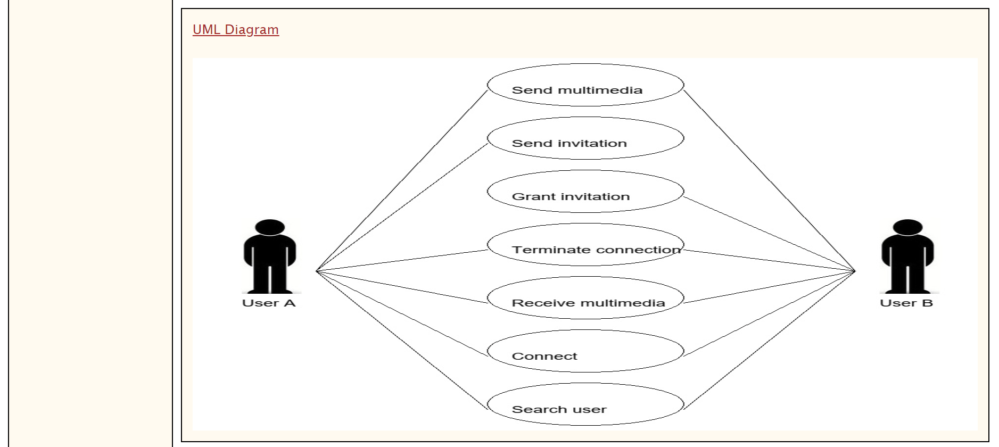

# UML-Generator-Using-NLP

Use case modeling is an important requirements engineering technique which plays an important role in describing the systems specifications and facilitating systems development.  
The website can extract the required elements that are needed to automatically generate use case diagrams from specification documents which are written in common natural language.
It uses Natural Language Processing (NLP) techniques to parse specifications syntactically based on a predefined set of heuristic rules.

## Main screen:

## Example:

